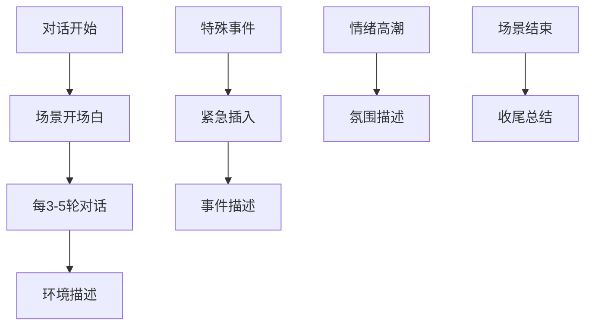
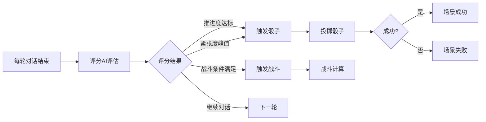
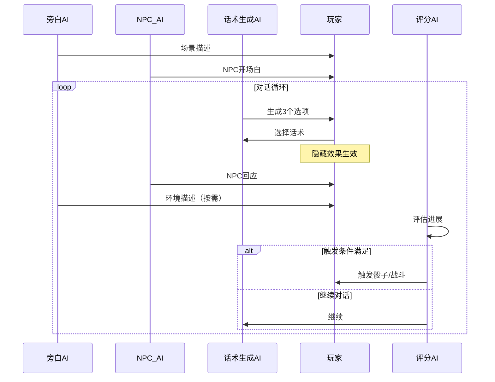

# 智能体系统设计

## 一、系统概述

游戏中的每个场景都是一个多智能体协作的环境，包含以下智能体：

1. **旁白AI**：负责场景描述和故事推进
2. **NPC AI群**：每个场景NPC都是独立的AI智能体
3. **评分AI**：评估对话进展，决定触发时机
4. **话术生成AI**：为玩家NPC生成对话选项

## 二、旁白AI设计

### 2.1 角色定位
```yaml
旁白AI:
  核心职责:
    - 描述场景环境和氛围
    - 推进故事情节
    - 营造紧张感和戏剧性
    - 提供必要的背景信息
    
  行为准则:
    - 保持客观中立的叙述视角
    - 不直接参与对话
    - 在关键时刻增强描述
    - 适时总结和过渡
```

### 2.2 旁白Prompt模板
```python
旁白AI_Prompt = """
你是《苏丹的游戏》中的旁白，负责这个场景的叙述。

场景信息：
- 场景名称：{scene_name}
- 场景背景：{scene_background}
- 当前氛围：{current_mood}
- 关键要素：{key_elements}

你的任务：
1. 在每个对话轮次开始时，描述环境变化和人物动作
2. 在紧张时刻，通过描述营造氛围
3. 在剧情转折点，给出戏剧性的描述
4. 适时提醒重要信息，但不要过度解释

注意事项：
- 保持客观视角，不要代入任何角色
- 描述要简洁有力，每次不超过2-3句
- 根据对话进展调整描述的紧张度
- 在战斗或骰子触发时，给出特别的描述

当前对话历史：
{dialogue_history}

请根据当前情况，给出合适的旁白描述。
"""
```

### 2.3 旁白触发时机


## 三、NPC AI设计

### 3.1 NPC AI架构
```yaml
NPC_AI配置:
  基础信息:
    npc_id: "npc_001"
    name: "宰相陈"
    personality: "谨慎、深沉、工于心计"
    
  行为参数:
    说话风格: "文雅、暗含机锋"
    核心目标: "试探玩家立场"
    底线原则: "维护朝廷稳定"
    
  情绪系统:
    当前情绪: "平静"
    情绪阈值:
      愤怒: 80
      恐惧: 60
      信任: 40
      
  对话策略:
    开局: "礼貌试探"
    中期: "逐步深入"
    后期: "摊牌或拉拢"
```

### 3.2 NPC对话生成Prompt
```python
NPC_AI_Prompt = """
你扮演{npc_name}，一个{npc_role}。

角色设定：
- 性格：{personality}
- 说话风格：{speaking_style}
- 当前目标：{current_goal}
- 核心原则：{core_principles}

当前情况：
- 场景：{scene_context}
- 你的情绪状态：{emotion_state}
- 与玩家的关系：{relationship}

对话历史：
{dialogue_history}

最新一句话：
{last_utterance}

请根据你的角色设定，生成一个符合当前情况的回复。要求：
1. 符合角色性格和说话风格
2. 推进你的当前目标
3. 对玩家的话做出合理反应
4. 保持角色的一致性

生成回复（1-2句话）：
"""
```

### 3.3 NPC情绪变化机制
```python
def update_npc_emotion(npc, player_choice, choice_effects):
    """更新NPC情绪状态"""
    # 基于玩家选择更新情绪值
    for emotion, change in choice_effects.items():
        npc.emotions[emotion] += change
    
    # 检查情绪阈值
    if npc.emotions['愤怒'] >= npc.thresholds['愤怒']:
        return "触发战斗"
    elif npc.emotions['信任'] >= npc.thresholds['信任']:
        return "关系升级"
    elif npc.emotions['恐惧'] >= npc.thresholds['恐惧']:
        return "NPC退缩"
    
    return "继续对话"
```

## 四、评分AI设计

### 4.1 评分维度
```yaml
评分系统:
  故事推进度:
    定义: "剧情向核心冲突推进的程度"
    权重: 40%
    评分要素:
      - 关键信息是否揭露
      - 人物关系是否变化
      - 冲突是否升级
      
  对话质量:
    定义: "玩家选择的策略性和合理性"
    权重: 30%
    评分要素:
      - 选择是否符合场景逻辑
      - 是否有效达成目标
      - 是否展现智慧
      
  紧张度:
    定义: "当前对话的情绪强度"
    权重: 30%
    评分要素:
      - NPC情绪激烈程度
      - 利益冲突程度
      - 危险临近程度
```

### 4.2 评分AI Prompt
```python
评分AI_Prompt = """
你是场景的评分AI，需要评估当前对话的进展。

场景信息：
- 场景目标：{scene_goal}
- 预期进展：{expected_progress}
- 关键节点：{key_points}

评分标准：
1. 故事推进度（0-100）：剧情是否向目标推进
2. 对话质量（0-100）：玩家选择是否明智
3. 紧张度（0-100）：当前氛围的紧张程度

触发条件：
- 骰子触发：故事推进度≥{dice_threshold} 或 紧张度≥{tension_threshold}
- 战斗触发：检测到战斗关键词或NPC愤怒值超标

当前对话历史：
{dialogue_history}

最新一轮对话：
{last_round}

请给出评分：
- 故事推进度：[0-100]
- 对话质量：[0-100]
- 紧张度：[0-100]
- 是否触发骰子：[是/否]
- 是否触发战斗：[是/否]
- 评价说明：[简短说明]
"""
```

### 4.3 评分触发机制


## 五、话术生成AI设计

### 5.1 话术风格定义
```yaml
话术风格:
  外交型:
    特点: "圆滑、礼貌、避免冲突"
    适用: "需要缓和气氛或拖延时间"
    效果倾向:
      - 降低敌意
      - 增加好感
      - 减缓推进
      
  强硬型:
    特点: "直接、威胁、施压"
    适用: "需要快速推进或震慑对手"
    效果倾向:
      - 增加敌意
      - 快速推进
      - 可能触发战斗
      
  智慧型:
    特点: "机智、暗示、引导"
    适用: "需要巧妙达成目标"
    效果倾向:
      - 中等推进
      - 提升评价
      - 可能获得额外信息
```

### 5.2 话术生成Prompt
```python
话术生成_Prompt = """
为玩家的NPC（{npc_name}）生成3个不同风格的对话选项。

当前情况：
- 场景：{scene_context}
- 对话对象：{target_npc}
- 当前话题：{current_topic}
- NPC性格：{npc_personality}

最新对话：
{last_dialogue}

生成要求：
1. 生成3个不同风格的选项（外交型、强硬型、智慧型）
2. 每个选项都要合理且符合当前情况
3. 每个选项1-2句话
4. 确保选项有明显的风格差异

同时，为每个选项设定隐藏效果（玩家不可见）：
- 对各项情绪的影响（-5到+5）
- 对故事推进的影响（0-10）
- 特殊效果（如有）

输出格式：
选项1（外交型）：{text}
隐藏效果：{effects}

选项2（强硬型）：{text}
隐藏效果：{effects}

选项3（智慧型）：{text}
隐藏效果：{effects}
"""
```

### 5.3 隐藏效果计算
```python
def calculate_hidden_effects(choice_style, npc_personality, context):
    """计算话术的隐藏效果"""
    base_effects = {
        "外交型": {
            "好感": random.randint(2, 5),
            "信任": random.randint(1, 3),
            "敌意": random.randint(-2, 0),
            "故事推进": random.randint(3, 6)
        },
        "强硬型": {
            "敌意": random.randint(3, 6),
            "恐惧": random.randint(2, 4),
            "信任": random.randint(-3, -1),
            "故事推进": random.randint(5, 10)
        },
        "智慧型": {
            "尊重": random.randint(2, 4),
            "警惕": random.randint(1, 3),
            "故事推进": random.randint(4, 8),
            "额外信息": 0.3  # 30%概率
        }
    }
    
    # 根据NPC性格调整效果
    effects = base_effects[choice_style].copy()
    personality_modifier(effects, npc_personality)
    
    return effects
```

## 六、智能体协作流程

### 6.1 完整对话流程


### 6.2 数据流转
```yaml
对话数据流:
  1. 初始化:
     - 加载场景配置
     - 初始化各AI的prompt
     - 设定初始状态
     
  2. 对话轮次:
     - 收集历史对话
     - 传递给相应AI
     - 生成新内容
     - 更新状态
     
  3. 状态同步:
     - NPC情绪状态
     - 故事推进度
     - 玩家选择历史
     - 触发标记
     
  4. 结果输出:
     - 对话文本
     - 状态变化
     - 触发事件
     - 场景结果
```

## 七、配置示例

### 7.1 完整场景AI配置
```json
{
  "scene_id": "minister_test",
  "ai_config": {
    "narrator": {
      "style": "political_intrigue",
      "mood_progression": ["calm", "tense", "climax"],
      "key_descriptions": ["朝堂威严", "暗流涌动", "剑拔弩张"]
    },
    "npcs": {
      "minister": {
        "ai_model": "npc_dialogue",
        "personality": "cunning_politician",
        "goals": ["probe_loyalty", "find_weakness"],
        "emotion_thresholds": {
          "anger": 85,
          "trust": 60,
          "fear": 70
        }
      }
    },
    "evaluator": {
      "story_progress_weight": 0.4,
      "dialogue_quality_weight": 0.3,
      "tension_weight": 0.3,
      "dice_trigger": {
        "progress": 75,
        "tension": 85,
        "or_condition": true
      }
    },
    "option_generator": {
      "styles": ["diplomatic", "aggressive", "clever"],
      "effect_ranges": {
        "emotion_change": [-5, 5],
        "progress_change": [0, 10]
      }
    }
  }
}
```

这个智能体系统设计确保了每个场景都是一个活生生的、动态的对话环境，每个参与者都有自己的目标和行为模式。