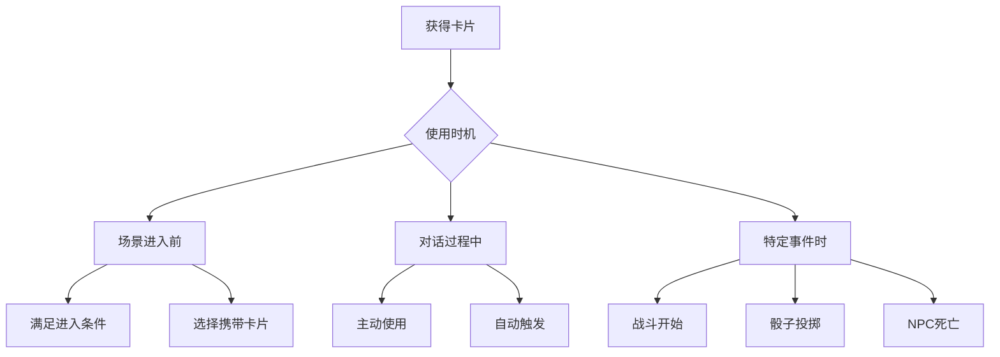
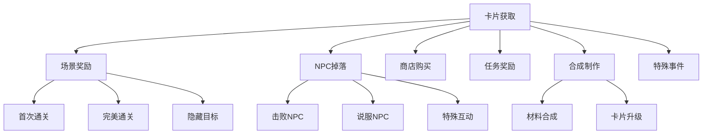

# 卡片系统设计

## 一、卡片系统概述

卡片是游戏中的重要资源，具有多重作用：
1. **场景进入条件**：某些场景需要特定卡片才能进入
2. **属性增强**：临时或永久改变NPC属性
3. **影响判定**：影响评分AI的判断标准
4. **特殊效果**：触发特殊事件或机制

## 二、卡片分类体系

### 2.1 按功能分类

```yaml
卡片类型:
  通行证类:
    作用: "满足场景进入条件"
    示例:
      - 朝廷通行证：进入朝堂场景
      - 军营令牌：进入军营场景
      - 黑市密令：进入黑市场景
      
  属性增强类:
    作用: "改变NPC属性值"
    示例:
      - 勇气之证：STR +10（单场景）
      - 智慧宝珠：INT +5（永久）
      - 防护符咒：DEF +15（3场景）
      
  影响判定类:
    作用: "影响评分AI判定"
    示例:
      - 贿赂金币：降低骰子触发阈值
      - 威压令牌：增加对话影响力
      - 幸运符：提高骰子成功率
      
  特殊功能类:
    作用: "特殊机制和效果"
    示例:
      - 复活药水：复活一个死亡NPC
      - 传送符：直接离开当前场景
      - 情报密函：揭示隐藏信息
```

### 2.2 按稀有度分类

```yaml
稀有度等级:
  普通（白色）:
    获取: "常见掉落，商店购买"
    效果: "基础效果，数值较小"
    示例: "小型属性提升，基础通行证"
    
  稀有（蓝色）:
    获取: "场景奖励，特定NPC掉落"
    效果: "中等效果，可能有额外作用"
    示例: "中型属性提升，特殊通行证"
    
  史诗（紫色）:
    获取: "困难场景奖励，BOSS掉落"
    效果: "强力效果，独特机制"
    示例: "大型属性提升，影响判定"
    
  传说（橙色）:
    获取: "特殊成就，隐藏任务"
    效果: "改变游戏规则的效果"
    示例: "复活NPC，直接通过场景"
```

## 三、卡片使用机制

### 3.1 使用时机



### 3.2 卡片效果类型

```python
# 卡片效果定义
class CardEffect:
    def __init__(self):
        self.effect_type = None  # immediate/duration/permanent
        self.target = None       # self/npc/scene/global
        self.conditions = []     # 触发条件
        
# 立即效果
class ImmediateEffect(CardEffect):
    """使用后立即生效，一次性"""
    examples = [
        "恢复30点HP",
        "下一次骰子额外+2个",
        "立即获得一个情报"
    ]
    
# 持续效果
class DurationEffect(CardEffect):
    """在一定时间内持续生效"""
    examples = [
        "本场景内STR+10",
        "接下来3个场景DEF+5",
        "今日内所有骰子成功率+10%"
    ]
    
# 永久效果
class PermanentEffect(CardEffect):
    """永久改变游戏状态"""
    examples = [
        "永久INT+3",
        "解锁隐藏对话选项",
        "改变NPC初始态度"
    ]
```

### 3.3 卡片影响评分机制

```yaml
评分影响机制:
  直接影响:
    骰子阈值调整:
      - 贿赂金币：触发阈值 -10
      - 威压令牌：触发阈值 -15
      
    成功率调整:
      - 幸运符：骰子成功率 +10%
      - 命运骰子：保证至少2个成功
      
  间接影响:
    对话权重调整:
      - 话术大师：智慧型选项效果 x1.5
      - 外交官徽章：外交型选项不增加敌意
      
    评分标准调整:
      - 剧情加速器：故事推进度计算 x1.2
      - 冷静药剂：紧张度上升速度 x0.8
```

## 四、卡片配置模板

### 4.1 基础配置结构

```json
{
  "card_id": "card_court_pass",
  "name": "朝廷通行证",
  "rarity": "common",
  "card_type": "pass",
  "sub_type": "access",
  "flavor_text": "允许进入朝堂相关场景",
  "icon": "court_pass.png",
  "usage": {
    "consumable": false
  },
  "effects": {
    "primary_effects": [
      {
        "effect_type": "scene_access",
        "target_scenes": ["court_*", "minister_*"]
      }
    ]
  },
  "acquisition": {
    "shop": {
        "available": true,
        "price": 100
    },
    "drop_sources": ["scene_intro_complete"]
  }
}
```

### 4.2 复杂卡片示例

```json
{
  "card_id": "card_bribe_gold",
  "name": "贿赂金币",
  "rarity": "rare",
  "card_type": "influence",
  "flavor_text": "金钱能打开许多紧闭的大门",
  "usage": {
    "consumable": true,
    "use_timing": "scene_entry"
  },
  "effects": {
    "primary_effects": [
      {
        "effect_type": "scene_modifier",
        "target": "npc_initial_attitude",
        "value": "+10",
        "duration": "current_scene"
      },
      {
        "effect_type": "evaluator_modifier",
        "target": "dice_threshold",
        "value": -15,
        "duration": "current_scene"
      }
    ],
    "conditional_effects": [
        {
            "condition": "target_is_greedy",
            "effect": "double_effectiveness"
        },
        {
            "condition": "target_is_honest",
            "effect": "negative_reaction"
        }
    ],
    "side_effects": [
      {
        "type": "reputation",
        "value": -5,
        "trigger": "on_use"
      }
    ]
  },
  "acquisition": {
     "shop": { "price": 500 }
  }
}
```

## 五、卡片与场景交互

### 5.1 场景进入要求

```yaml
场景卡片要求:
  必需卡片:
    定义: "没有这些卡片无法进入"
    消耗: "可配置是否消耗"
    示例:
      - 军营场景：需要"军令牌"
      - 黑市场景：需要"黑市密令"
      
  可选卡片:
    定义: "携带可获得额外好处"
    效果: "降低难度或增加奖励"
    示例:
      - 携带"贿赂金币"：初始好感+10
      - 携带"推荐信"：解锁特殊对话
```

### 5.2 卡片槽位系统

```python
class SceneCardSlots:
    """场景卡片槽位配置"""
    def __init__(self):
        self.required_slots = []  # 必需卡片槽
        self.optional_slots = 3   # 可选卡片槽数量
        self.auto_use = []        # 自动使用的卡片类型
        
    def validate_entry(self, player_cards):
        """验证玩家是否满足进入条件"""
        for required in self.required_slots:
            if required not in player_cards:
                return False, f"缺少必需卡片：{required}"
        return True, "可以进入"
        
    def apply_optional_effects(self, selected_cards):
        """应用可选卡片效果"""
        effects = []
        for card in selected_cards:
            effects.extend(card.get_scene_effects())
        return effects
```

## 六、卡片获取途径

### 6.1 获取方式



### 6.2 掉落配置

```yaml
卡片掉落表:
  场景掉落:
    普通通关:
      - 70%: 普通卡片x1
      - 25%: 稀有卡片x1
      - 5%: 史诗卡片x1
      
    完美通关:
      - 50%: 稀有卡片x1
      - 35%: 史诗卡片x1
      - 15%: 传说卡片x1
      
  NPC掉落:
    普通NPC:
      - 必掉: 属性点
      - 30%: 普通卡片
      
    精英NPC:
      - 必掉: 属性点+普通卡片
      - 50%: 稀有卡片
      
    BOSS NPC:
      - 必掉: 大量属性点+稀有卡片
      - 80%: 史诗卡片
      - 20%: 传说卡片
```

## 七、卡片平衡设计

### 7.1 数值平衡

```python
# 卡片效果数值标准
CARD_BALANCE = {
    "common": {
        "attribute_bonus": (1, 5),      # 属性加成范围
        "duration": "single_scene",      # 持续时间
        "cooldown": 0,                   # 冷却时间
        "cost": (50, 200)               # 价格范围
    },
    "rare": {
        "attribute_bonus": (5, 10),
        "duration": "3_scenes",
        "cooldown": 1,  # 1天冷却
        "cost": (200, 1000)
    },
    "epic": {
        "attribute_bonus": (10, 20),
        "duration": "permanent",
        "cooldown": 3,
        "cost": (1000, 5000)
    },
    "legendary": {
        "attribute_bonus": "special",    # 特殊效果
        "duration": "special",
        "cooldown": "once_per_game",
        "cost": "not_for_sale"
    }
}
```

### 7.2 使用限制

```yaml
卡片使用限制:
  数量限制:
    - 同名卡片最多携带3张
    - 每场景可选卡片上限5张
    - 战斗中使用卡片上限2张
    
  时机限制:
    - 场景开始前：通行证类、准备类
    - 对话过程中：影响类、增益类  
    - 战斗触发时：战斗类、防御类
    - 任意时刻：特殊类（消耗品）
    
  条件限制:
    - 等级要求
    - 属性要求
    - 前置卡片要求
    - 声望要求
```

## 八、卡片组合效果

### 8.1 套装效果

```yaml
卡片套装:
  外交官套装:
    包含: ["外交官徽章", "和平使者", "贸易许可"]
    2件效果: "所有外交型选项效果+20%"
    3件效果: "免疫敌意增加效果"
    
  刺客套装:
    包含: ["暗影斗篷", "剧毒匕首", "潜行药剂"]
    2件效果: "战斗首回合必定暴击"
    3件效果: "可以刺杀取代正常战斗"
```

### 8.2 卡片联动

```python
# 卡片联动效果
CARD_SYNERGIES = {
    ("智慧宝珠", "话术大师"): {
        "effect": "额外生成第4个对话选项",
        "description": "智慧与口才的完美结合"
    },
    ("贿赂金币", "威压令牌"): {
        "effect": "直接跳过前置对话",
        "description": "软硬兼施，无往不利"
    }
}
```

## 九、数据存储结构

### 9.1 玩家卡片库

```sql
-- 玩家持有卡片
CREATE TABLE player_cards (
    id SERIAL PRIMARY KEY,
    player_id INTEGER REFERENCES players(id),
    card_id VARCHAR(50) REFERENCES card_definitions(card_id),
    quantity INTEGER DEFAULT 1,
    acquired_date TIMESTAMP,
    last_used TIMESTAMP,
    use_count INTEGER DEFAULT 0,
    custom_data JSONB  -- 存储卡片特殊状态
);
```

### 9.2 场景卡片配置

```sql
-- 场景卡片要求
CREATE TABLE scene_card_requirements (
    id SERIAL PRIMARY KEY,
    scene_id VARCHAR(50) REFERENCES scenes(scene_id),
    card_id VARCHAR(50) REFERENCES card_definitions(card_id),
    requirement_type VARCHAR(20), -- 'required' or 'optional'
    consume_on_use BOOLEAN DEFAULT FALSE,
    effect_data JSONB
);
```

这个卡片系统设计提供了丰富的策略选择，让玩家可以通过合理使用卡片来应对不同的挑战。