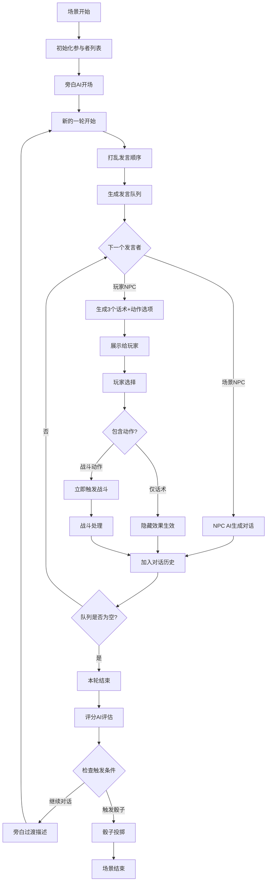
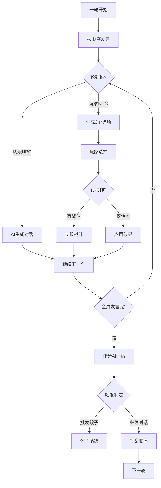

# 对话流程重新设计

## 一、核心对话机制

### 1.1 对话顺序原则
1. **每轮对话**：所有参与者（场景NPC + 玩家NPC）都要发言一次
2. **顺序执行**：按照预定顺序，每个角色轮流发言
3. **玩家选择**：只有轮到玩家NPC时，才生成3个选项供玩家选择
4. **选项内容**：每个选项包含话术+动作（动作只有战斗）
5. **即时触发**：选择带有战斗动作的选项会立即触发战斗
6. **轮次结束**：所有人发言完毕后，评分AI进行评估
7. **顺序打乱**：每轮结束后，重新打乱下一轮的发言顺序

### 1.2 详细流程图



## 二、对话轮次示例

### 2.1 场景参与者
- **场景NPC**：宰相、宰相助手
- **玩家NPC**：谋士李白、护卫张飞

### 2.2 第一轮对话顺序（初始）
```
1. 旁白AI：场景开场描述
2. 宰相：开场发言
3. 宰相助手：补充说明
4. 谋士李白：玩家选择话术
5. 护卫张飞：玩家选择话术
6. 评分AI：本轮评估
```

### 2.3 第二轮对话顺序（打乱后）
```
1. 护卫张飞：玩家选择话术
2. 宰相：回应
3. 谋士李白：玩家选择话术
4. 宰相助手：评论
5. 评分AI：本轮评估
```

## 三、详细对话流程示例

```yaml
场景：宰相的试探
参与者：
  场景NPC：[宰相, 助手]
  玩家NPC：[谋士, 护卫]

--- 第一轮 ---
发言顺序：[宰相, 助手, 谋士, 护卫]

[旁白AI]：朝堂之上，宰相端坐中央，目光如炬。

[宰相]：听闻你最近在民间颇有声望，不知对朝政有何见解？

[助手]：大人问的是近日税收之事。

[谋士-玩家选择]：
1. "民间疾苦，确需朝廷关注。"（直言）
   隐藏效果：宰相警觉+3，故事推进+5
   
2. "在下不敢妄议朝政。"（谦逊）
   隐藏效果：宰相轻视+2，故事推进+2
   
3. "或许宰相大人另有高见？"（试探）
   隐藏效果：宰相警觉+5，紧张度+10

→ 玩家选择1

[护卫-玩家选择]：
1. "我只负责保护主人。"（回避）
   隐藏效果：忠诚展示+1
   
2. "大人若有异议，不妨直说！"（强硬）
   隐藏效果：敌意+8，紧张度+15
   
3. "助手大人，你这是什么意思？"（质问）+ [动作：挑战助手战斗]
   隐藏效果：转移矛盾，故事推进+8
   动作效果：若助手接受，立即触发与助手的战斗

→ 玩家选择3
[立即触发：护卫 vs 助手 战斗]

[战斗处理]：
护卫（STR:80, DEF:60, HP:200） vs 助手（STR:40, DEF:30, HP:100）
战斗结果：护卫胜利，助手重伤退场
护卫HP: 200 → 160

[旁白AI]：护卫一拳将助手击倒，朝堂瞬间陷入死寂。

[场景变化]：助手退出本场景，无法继续对话

[评分AI]：
- 故事推进度：25/100（战斗导致剧情突变）
- 对话质量：激进但有效
- 紧张度：65/100（大幅提升）
- 继续对话

--- 第二轮 ---
发言顺序：[护卫, 宰相, 谋士]（助手已退场，重新排序）

[旁白AI]：宰相看着倒地的助手，眼中闪过一丝寒光。

[护卫-玩家选择]：
1. "助手冒犯在先，请宰相见谅。"（道歉）
   隐藏效果：态度软化+3，宰相愤怒-2
   
2. "这就是宰相大人的待客之道？"（反问）+ [动作：挑战宰相战斗]
   隐藏效果：宰相愤怒+10，敌意+15
   动作效果：立即与宰相战斗
   
3. "宰相大人，我们继续谈正事。"（转移话题）
   隐藏效果：冷静+5，故事推进+3

→ 玩家选择3

[宰相]：好大的胆子！在朝堂上行凶，你们可知罪？

[谋士-玩家选择]：
1. "此乃误会，还请宰相明察。"（解释）
   隐藏效果：缓和气氛+5，宰相怒气-3
   
2. "宰相若要治罪，悉听尊便。"（硬气）
   隐藏效果：对抗姿态+8，紧张度+10
   
3. "不如我们私下解决此事？"（贿赂）
   隐藏效果：宰相贪婪+5，可能接受贿赂

→ 玩家选择1

[评分AI]：
- 故事推进度：35/100
- 对话质量：优秀
- 紧张度：35/100
- 继续对话

[继续循环...]
```

## 四、话术与战斗系统

### 4.1 选项生成结构

```python
class DialogueOption:
    def __init__(self):
        self.text = ""  # 话术内容
        self.style = ""  # 外交/强硬/智慧
        self.combat_target = None  # 战斗目标（如果有）
        self.hidden_effects = {}  # 隐藏效果

# 选项生成示例
def generate_options(npc, context):
    options = []
    
    # 选项1：纯话术
    opt1 = DialogueOption()
    opt1.text = "宰相明鉴，在下只是就事论事。"
    opt1.style = "diplomatic"
    opt1.hidden_effects = {"宰相好感": +3, "故事推进": +5}
    
    # 选项2：纯话术
    opt2 = DialogueOption()
    opt2.text = "或许我们该换个话题。"
    opt2.style = "evasive"
    opt2.hidden_effects = {"紧张度": -5, "故事推进": +2}
    
    # 选项3：话术+战斗
    opt3 = DialogueOption()
    opt3.text = "你敢再说一遍？"
    opt3.style = "aggressive"
    opt3.combat_target = "宰相"  # 挑战宰相战斗
    opt3.hidden_effects = {"敌意": +10}
    
    return [opt1, opt2, opt3]
```

### 4.2 战斗计算

```python
def calculate_combat(attacker, defender):
    """简单的战斗计算"""
    # 基础伤害 = 攻击力 - 防御力
    damage = max(attacker.STR - defender.DEF, 10)  # 最少造成10点伤害
    
    # 扣除HP
    defender.HP -= damage
    
    # 返回战斗信息
    return {
        "attacker": attacker.name,
        "defender": defender.name,
        "damage": damage,
        "defender_hp_remaining": max(defender.HP, 0)
    }

def combat_loop(npc1, npc2):
    """战斗循环直到一方HP归零"""
    rounds = []
    while npc1.HP > 0 and npc2.HP > 0:
        # NPC1攻击
        result1 = calculate_combat(npc1, npc2)
        rounds.append(result1)
        if npc2.HP <= 0:
            break
            
        # NPC2反击
        result2 = calculate_combat(npc2, npc1)
        rounds.append(result2)
    
    winner = npc1 if npc1.HP > 0 else npc2
    loser = npc2 if npc1.HP > 0 else npc1
    
    return winner, loser, rounds
```

## 五、评分系统与触发机制

### 5.1 评分时机



### 5.2 评分AI的判定逻辑

```python
def evaluate_round(round_data):
    """评分AI在每轮结束后的评估"""
    evaluation = {
        "story_progress": 0,
        "dialogue_quality": 0,
        "tension_level": 0,
        "special_flags": []
    }
    
    # 分析本轮对话
    for speech in round_data.speeches:
        if speech.type == "player_choice":
            # 玩家选择的影响
            evaluation["story_progress"] += speech.hidden_effects.get("故事推进", 0)
            evaluation["tension_level"] += speech.hidden_effects.get("紧张度", 0)
            
            # 如果有战斗发生
            if hasattr(speech, 'combat_target') and speech.combat_target:
                evaluation["special_flags"].append("combat_occurred")
                evaluation["tension_level"] += 20
        
        # 分析对话质量
        evaluation["dialogue_quality"] = analyze_dialogue_coherence(round_data)
    
    # 决定是否触发
    if evaluation["story_progress"] >= DICE_TRIGGER_THRESHOLD:
        return "trigger_dice"
    elif evaluation["tension_level"] >= TENSION_THRESHOLD:
        return "high_tension_alert"
    else:
        return "continue_dialogue"
```

## 六、对话管理数据结构

### 6.1 轮次管理

```yaml
对话轮次结构:
  round_number: 3
  speaking_order: ["护卫", "宰相", "谋士"]  # 助手已在战斗中退场
  current_speaker_index: 2
  active_participants: 3  # 当前活跃参与者
  speeches_this_round:
    - speaker: "护卫"
      text: "助手大人，你这是什么意思？"
      type: "player_choice"
      combat_target: "助手"
      combat_result: {winner: "护卫", loser_removed: true}
    - speaker: "宰相"
      text: "好大的胆子！"
      type: "npc_ai"
      emotion_change: {anger: +15}
    - speaker: "谋士"
      text: "此乃误会，还请宰相明察。"
      type: "player_choice"
      hidden_effects: {缓和气氛: +5, 宰相怒气: -3}
  round_complete: true
  round_evaluation:
    story_progress: 35
    tension_level: 65
    special_events: ["combat_occurred", "npc_removed"]
```

### 6.2 状态跟踪

```python
class DialogueState:
    def __init__(self):
        self.round_number = 0
        self.total_speeches = 0
        self.current_order = []
        self.active_npcs = {}  # 追踪活跃的NPC
        self.waiting_for_player = False
        self.round_evaluations = []
        self.combat_history = []  # 记录战斗
        
    def start_new_round(self, participants):
        self.round_number += 1
        # 过滤掉已退场的NPC
        active_participants = [p for p in participants if p.id in self.active_npcs]
        self.current_order = self.shuffle_order(active_participants)
        self.current_speaker_index = 0
        
    def handle_combat_result(self, winner, loser):
        """处理战斗结果，可能移除NPC"""
        self.combat_history.append({
            "round": self.round_number,
            "winner": winner.id,
            "loser": loser.id
        })
        
        if loser.hp <= 0:
            # NPC退场
            del self.active_npcs[loser.id]
            # 从当前顺序中移除
            self.current_order = [npc for npc in self.current_order if npc.id != loser.id]
            
            if loser.is_player_npc and len([n for n in self.active_npcs.values() if n.is_player_npc]) == 0:
                return "scene_failed"  # 所有玩家NPC死亡
        
        return "continue"
```

## 七、关键设计要点

### 7.1 话术与战斗的结合
- **即时性**：战斗在选择时立即触发
- **简洁性**：动作只有战斗，没有其他复杂机制
- **策略性**：玩家需要判断何时挑起战斗

### 7.2 顺序循环的重要性
- **公平性**：每个角色都有平等的发言机会
- **完整性**：确保所有视角都被展现
- **动态性**：战斗可能改变参与者数量

### 7.3 打乱机制的作用
- **不可预测**：每轮顺序都不同
- **适应性**：需要根据发言顺序调整策略
- **真实感**：模拟真实对话的随机性

### 7.4 评分节点的意义
- **轮次总结**：每轮结束后的整体评估
- **进度追踪**：累计故事推进度
- **触发判定**：基于整轮表现决定后续

### 7.5 战斗融入对话的优势
- **紧张感**：任何时刻都可能爆发冲突
- **后果性**：战斗可能永久改变场景格局
- **选择权重**：每个选择都需要慎重考虑

这样的设计让对话不仅仅是选择文字，而是一个充满变数和策略的动态系统。