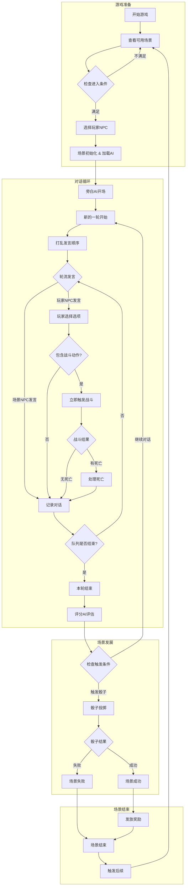
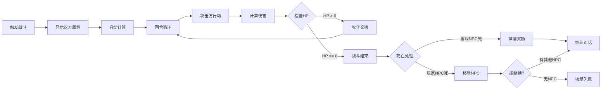

# 场景流程设计

## 一、场景流程总览



## 二、场景配置详解

### 2.1 场景进入流程

```
场景列表展示
    ↓
显示每个场景的：
- 名称和描述
- 进入条件（属性要求、卡片要求）
- 推荐NPC类型
- 难度星级
    ↓
玩家选择场景
    ↓
系统检查：
1. 属性是否满足
2. 必需卡片是否拥有
3. 前置场景是否完成
    ↓
选择携带的玩家NPC（1-3个）
    ↓
消耗必需卡片
    ↓
进入场景
```

### 2.2 场景配置示例

```yaml
场景：宰相的试探
  配置信息：
    场景ID: scene_minister_test
    场景类型: 常驻
    重复次数: 3次/游戏周期
    
  进入条件：
    属性要求：
      - 玩家总声望 >= 50
      - 至少一个NPC的INT >= 10
    卡片要求：
      必需：["朝廷通行证"]
      可选：["贿赂金币", "情报网密信"]
      
  场景设定：
    固定NPC：
      - 宰相（主要对话者，INT:15, CHA:12）
      - 朝廷书记官（记录者，INT:8）
    玩家可带NPC数：1-2个
    
  智能体配置：
    旁白设定：
      角色：客观叙述者
      任务：描述朝堂氛围，营造政治斗争的紧张感
      
    评分标准：
      故事推进阈值：75
      骰子触发条件：
        - 故事推进度 >= 75 OR
        - 关键信息获取 >= 2个 OR
        - 紧张度峰值 >= 85
      成功所需骰子：6个
      
  对话设计：
    预期轮数：15-25轮
    对话流程：采用轮次制，每轮所有参与者（场景NPC和玩家NPC）按随机顺序各发言一次。
    关键节点：
      - 第5轮：宰相开始试探
      - 第10轮：可能触发小冲突
      - 第15轮：进入核心议题
      - 第20轮：高潮或转折
```

## 三、多智能体协作机制

### 3.1 智能体角色分工

```
旁白AI
├── 场景描述
├── 氛围营造
├── 时间推进
└── 环境变化提示

NPC AI（每个NPC独立）
├── 基于性格的对话生成
├── 对玩家选择的反应
├── 与其他NPC的互动
└── 情绪状态表达

评分AI
├── 实时评估对话质量
├── 判断故事推进度
├── 检测关键节点
├── 决定触发时机
└── 给出场景评价

话术生成AI（为玩家NPC服务）
├── 分析当前局势
├── 生成3种风格选项
├── 计算隐藏影响值
└── 确保选项合理性
```

### 3.2 对话回合示例

```
--- 回合1 ---
参与者: [宰相, 谋士(玩家)]
发言顺序: [宰相, 谋士]

[旁白AI]: 朝堂之上，文武百官各就其位。宰相缓步走到中央，目光在你身上短暂停留。

[宰相]: 听闻你最近在民间颇有声望，不知对朝廷政务有何见解？

[谋士 - 玩家选择]:
1. "在下只是略尽绵薄之力，不敢妄议朝政。"（谦逊）
2. "民间疾苦，朝廷理应多加关注。"（直言）
3. "宰相大人过誉了，学生还需多多学习。"（恭维）

→ 玩家选择2

[隐藏效果]:
- 宰相警觉 +3
- 故事推进 +8
- 正直形象 +5

[评分AI]: (在本轮所有参与者发言结束后评估)
- 故事推进度：23/100
- 对话质量：良好
- 决定：继续对话

--- 回合2 ---
参与者: [宰相, 谋士(玩家)]
发言顺序: [谋士, 宰相] (顺序打乱)

[旁白AI]: 宰相捻了捻胡须，似乎对你的直言不讳有些意外。

[谋士 - 玩家选择]:
1. "尤其是近期的税收政策，似乎有待商榷。" (乘胜追击)
2. "当然，这只是在下的一点浅见。" (收回锋芒)
3. "不知宰相大人如何看待此事？" (抛出问题)

→ 玩家选择1

[隐藏效果]:
- 紧张度 +10
- 故事推进 +12

[宰相]: 哦？看来你对民生颇有想法。那么，你待如何？

[评分AI]: (评估中...)

[对话继续...]
```

## 四、战斗触发机制

### 4.1 战斗触发条件

```python
战斗触发检测：
  1. 关键词触发：
     if 对话包含 ["拔剑", "动手", "杀了你"]:
         触发战斗
         
  2. 情绪积累触发：
     if NPC.敌意值 >= 80:
         触发战斗
         
  3. 剧情触发：
     if 达到特定剧情节点:
         触发战斗
         
  4. 玩家主动触发：
     if 选择了攻击性话术 and 对方是可战斗NPC:
         触发战斗
```

### 4.2 战斗流程



## 五、奖励与成长系统

### 5.1 奖励类型

```yaml
场景成功奖励：
  固定奖励：
    - 属性点：10-50点
    - 经验值：用于解锁新内容
    
  概率奖励：
    - 人物卡片（30%）：获得新的玩家NPC
    - 稀有道具（20%）：特殊效果物品
    - 隐藏剧情（10%）：解锁支线
    
  连锁奖励：
    - 解锁新场景
    - 改变NPC关系
    - 影响后续剧情

NPC死亡掉落：
  游戏NPC死亡：
    - 必定掉落：配置的属性点
    - 可能掉落：特殊物品、情报
    
  掉落的属性点分配：
    - 玩家自由分配给任意玩家NPC
    - 每个属性都可以加点
    - 立即生效
```

### 5.2 属性点分配界面

```
击败宰相的刺客，获得15属性点！

当前玩家NPC：
┌─────────────┬─────────────┬─────────────┐
│   谋士李白   │   刺客影子   │   医师华佗   │
├─────────────┼─────────────┼─────────────┤
│ INT: 12→15  │ INT: 8      │ INT: 10     │
│ STR: 5      │ STR: 15→18  │ STR: 3      │
│ DEF: 3      │ DEF: 8→12   │ DEF: 5      │
│ HP: 100     │ HP: 150→180 │ HP: 80      │
│ CHA: 15     │ CHA: 5      │ CHA: 12     │
└─────────────┴─────────────┴─────────────┘

已分配：15/15 点
[确认分配] [重置分配]
```

## 六、场景结束与触发

### 6.1 场景结束条件

```
成功结束：
- 骰子投掷成功
- 达成特定对话目标
- 完成隐藏任务

失败结束：
- 骰子投掷失败
- 所有玩家NPC死亡
- 超过最大回合数
- 触发失败剧情
```

### 6.2 后续触发机制

```python
场景结束后：
  1. 结算奖励/惩罚
  
  2. 评分AI生成场景总结：
     - 关键选择回顾
     - 获得成就
     - 解锁提示
     
  3. 检查触发条件：
     if 满足特定条件:
         解锁新场景
         触发连锁事件
         改变游戏状态
         
  4. 更新场景列表：
     - 添加新解锁场景
     - 更新场景状态
     - 刷新进入条件
```

## 七、设计核心总结

1. **对话是一切的核心**：所有游戏内容都通过对话推进
2. **智能体创造真实感**：每个角色都是活的AI
3. **隐藏机制增加深度**：玩家需要观察和推理
4. **配置驱动的设计**：方便后续扩展内容
5. **多层次的策略性**：NPC选择、话术选择、资源分配